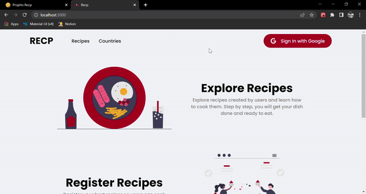
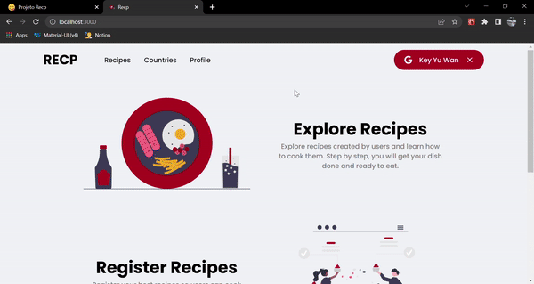
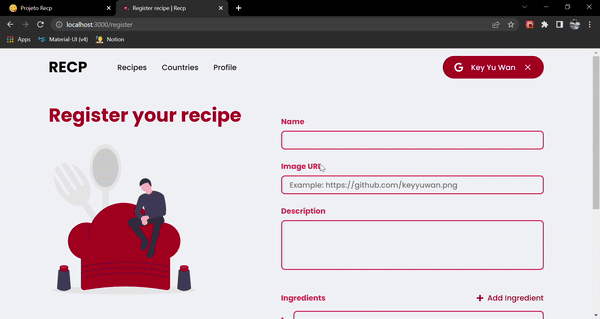

<h1 align="center">RECP</h1>

Recp is a project where you can explore dishes from various countries and learn how to cook them. Also, you can register your own recipes and authenticate with Google.

 

# 🎥 Overview:

# 🖥️ The project:

Recp is a dish explorer with various recipes from various contries. You can also register your own recipe from your own country.

### Functionalities:

- List all recipes;
- View each recipe;
- Social auth with Google;
- Create recipe;
- List all recipes from a specific country;
- List all recipes from a specific user;
- Server-side routes protection if a page can only be accessed by the authenticated user;
- Feedbacks with Toasts.

### What I learned and improved when developing this project:

- Improved my skills about Uncontrolled Components when developing forms;
- Improved my knowledge about SSR (Server-side rendering) and SSG (Static site generation);
- Learned how to make an app with Social Authentication using Next Auth;
- Learned more about dynamic routes in Next.js

# 👨‍💻 Technologies:

### • ReactJS

### • TypeScript

### • Next.js

### • Next Auth

### • Styled Components

### • Axios

### • React Hook Form
